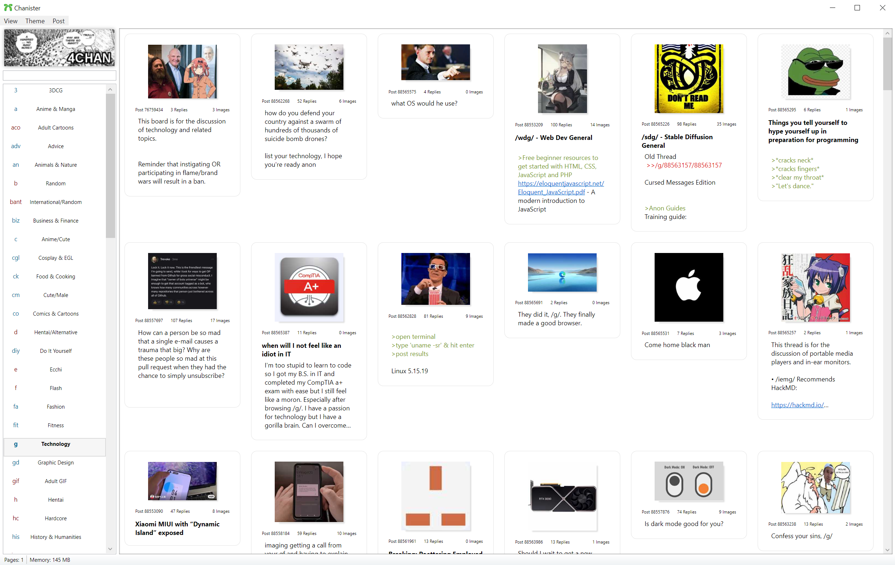
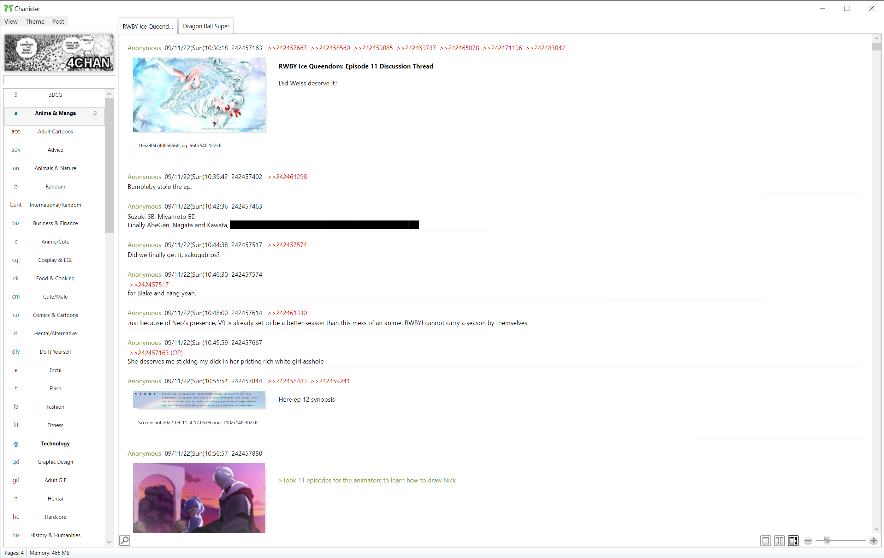
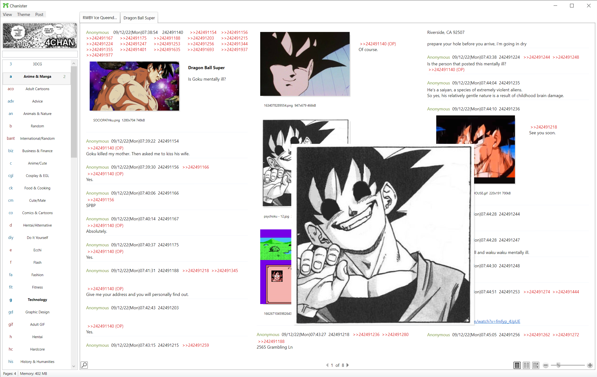

#  Chanister
Chanister is a browser for 4chan(nel) written in C# .NET 6 WPF only available for Windows™ (L*nux users might cope/seethe/fork).

## The current feature set
1. Browsing boards/threads/posts
2. Viewing images, gifs and webms
3. Saving images, gifs and webms through context menu and dialog

## Wanted features
This is what we need to implement, feel free to nuke old code if you find better solutions.
Take a look at issues too if you want to squash some bugs.
1. Posting - There is already some code for this.
2. Filtering
3. Thread/post saving
4. Theming
5. System notifications
6. Complete the missing tags for the tagparser
7. Installer/updater
8. Archive retrieval / search
9. ???
## Releases
Theese are pre-alpha and with no installer.
## Images
 
 
 
 
